 

# Wildcard Gallery V2

## What is this

This Automatic1111 extension primary adds a new extra networks gallery for wildcards along with preview thumbnails and other features for an enhanced wildcards management and user experience.

## Installation
- `git clone` this repo to the `extensions` folder in your Web UI installation, or paste the its link to the `extensions/Install form URL` tab in WebUi
- if you have the old Wildcard Gallery V1 extention consider removing before installing the new one (this a whole rebase from V1 so a clean reinstall is remcommended)
  - make sure to backup a copy the folders `metadata` and `cards` if you already have those populated then copy them back to the new extension folder afterward

## requirements
- This extension extends on the wildcard functionality so it goes without saying that you already have the **[sd-dynamic-prompts](https://github.com/adieyal/sd-dynamic-prompts)** extension in your WebUi ecosystem if not then you'll need to install the .
- This extension was made with Gradio 3.x in mind things may break with higher versions

## Wildcard Filter Tab

### Overview
The **Wildcard Filter Tab** is the most notable addition in Version 2 of the *Wildcard Gallery* addon. Without the limitations of the previous *Extra Network* subtab, this tab introduces a wide range of powerful features, such as:

- More advanced card filtering options  
- A cleaner, more resource-efficient viewer  
- Real-time preview channel switching  
- Card tagging support  
- Live card selection for operations (e.g., export, preview generation, tag editing)  
- Wildcard creation directly from within the WebUI  

---

### Tab Layout

The layout is intentionally simple and includes:

- **Filtering Options**  
  Handles the creation and execution of filtering queries.
  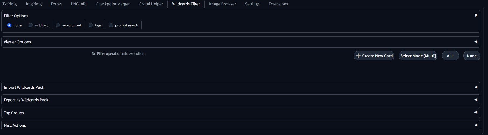

- **Cards Viewer**  

  Displays filter results as cards, paginated (typically 25 per page).  
  - Allows card selection for future operations  
  - Enables card creation  
  - Includes a **Viewer Options** subsection for tag visibility, preview cycling, and card grouping

- **Operations Sections**  
  Contains actions for selected cards or the entire wildcard dictionary.

---

### Terminology

- **Preview Channel**: A named profile that contains a different set of preview images for the wildcard dictionary. Used to visualize how wildcards behave in various prompt scenarios.

- **Tag Group**: A logical collection of tags that share display properties (e.g., color, masking behavior).

- **Wildcard Sequence**: An ordered set of wildcards under a shared parent, executed in a chained manner. Designed for niche cases like prompt-based storytelling.

---

### Filter Modes

#### Mode: `wildcard`

- The simplest mode. Displays a searchable dropdown of all wildcards in the dictionary.
- You can select one or multiple cards.
- Optionally extend the filter to include all cards with the same parent as the selected one.
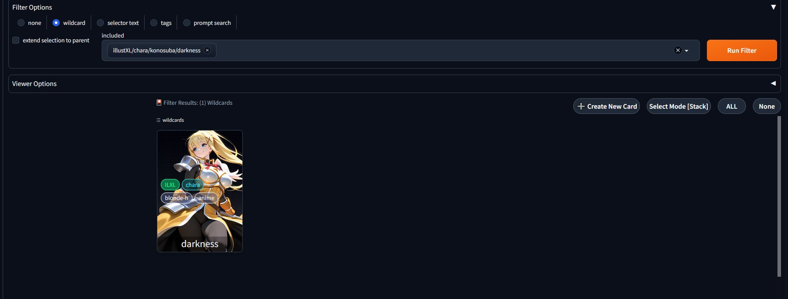 
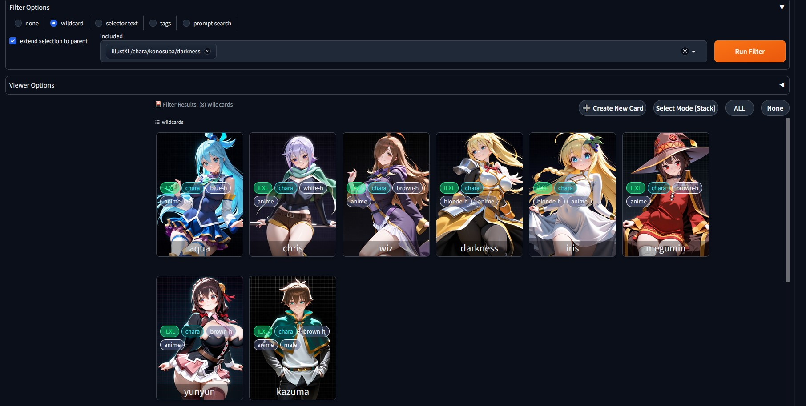 

#### Mode: `selector text`

- Uses selector-style input (e.g., `__parentA/parentB/exampleCard__`) to filter results.
- Wildcards can be targeted directly or via wildcard globbing:
  - `__parentA/parentB/*__` will show all cards under `parentB`.
- Supports multiple comma-separated selectors (e.g., `__x/y/*__, __z/card__`).

#### Mode: `tags`

- Filters cards based on custom user-defined tags.
- Supports **Inclusion Logic**:
  - `AND`: All specified tags must be present in a card.
  - `OR`: Any of the specified tags can be present.
- Tags placed in the *Excluded* dropdown will be used to reject cards with those tags.
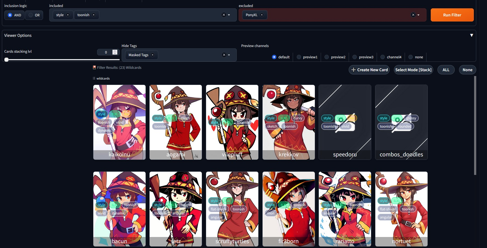 

#### Mode: `prompt search`

- The most specific and niche mode.  
  Filters based on the card’s internal prompt text.
- Supports **Included** and **Excluded** comma-separated terms (unordered).
 
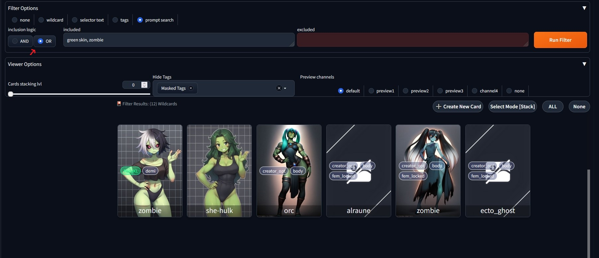 

---

### Cards Viewer

This is where you'll interact with filtered results in the form of cards.

- Uses pagination to ensure performance even with large datasets.
- Selection mode defaults to **Stacked**, but can be changed to **Single** in the top-right corner of the viewer.

---

### Viewer Options

Additional utilities can be accessed from the collapsed section above the card viewer:

- **Card Stacking Level**  
  Groups cards based on their parent rank.  
  - E.g., setting stacking to 3 will group `parentA/parentB/parentC/Card1` and `.../Card2` under a shared `parentC/*` stack.
  - Selecting a stack selects all cards within it.
  - Changing stacking level does *not* reset card selections.
  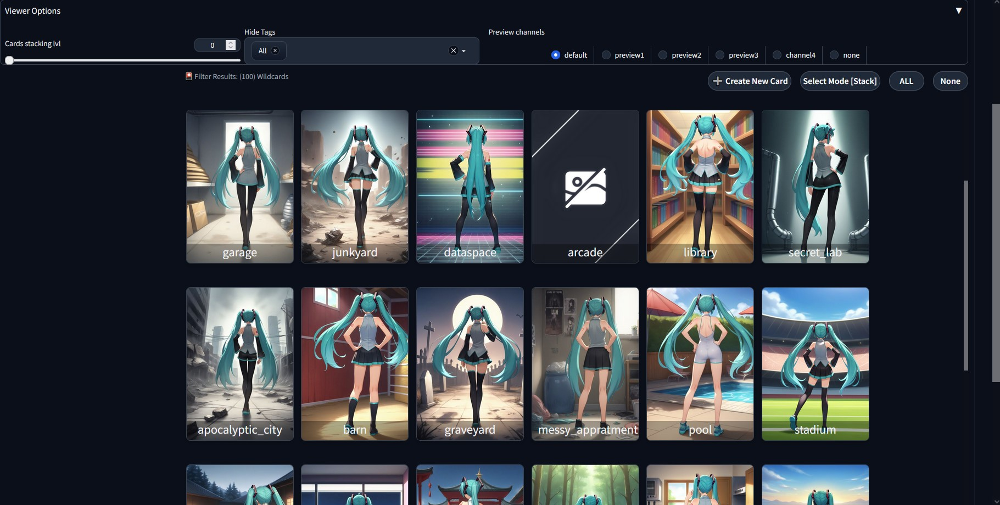 
  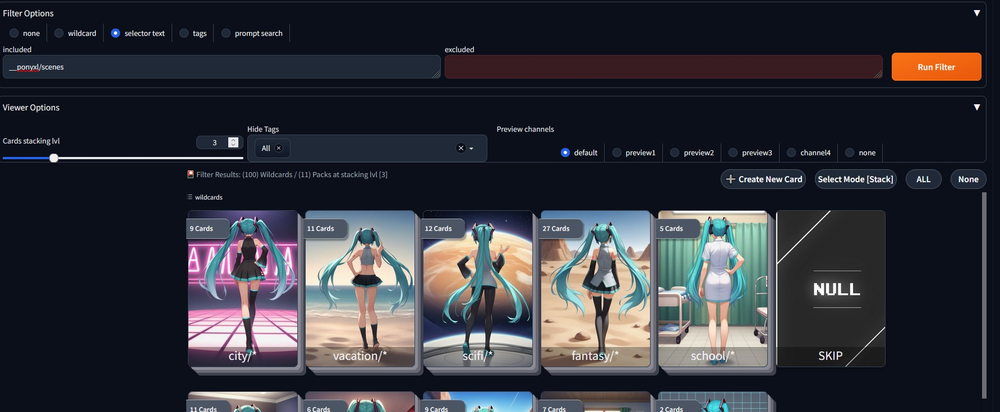 

- **Tag Masking**  
  Allows hiding or decluttering tags on cards based on their tag group settings.

- **Selected Preview Channel**  
  Lets you cycle through different preview images per card based on the chosen channel.

---

### Card Detail Panel

When you select a card, details and actions become available on the left-side panel.

**Actions (available for single or multiple selections):**
 

- **Copy to Clipboard**: Copies the wildcard activation text for manual prompt use.
- **Edit Card Tags**:
  - Add/remove tags using the dropdown or by typing a new one.
  - "Add Tag" attaches the tag; "Remove Tag" detaches it.
- **Favorite**: Adds cards to your favorites list.
- **Remove**: Currently disabled until card editing is fully implemented.

**Information:**
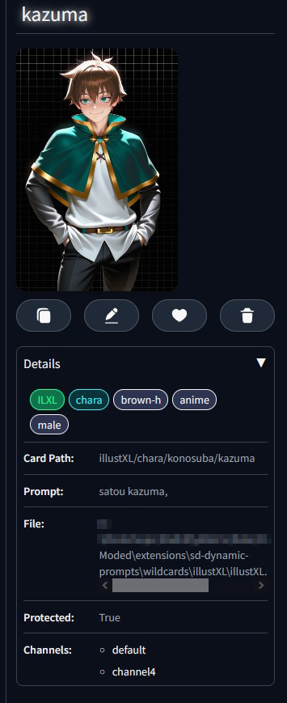 

- **Tags**: Full list of card tags (ignores masking).
- **Card Path**: The virtual path of the card in the dictionary.
- **Prompt**: The raw prompt text embedded in the wildcard.
- **File**: The physical location of the wildcard file.
- **Protected**: Indicates whether the card is protected from editing (feature not yet implemented).
- **Channels**: Lists which preview channels contain this card.

---

### Operations Sections

- **Import Wildcard Pack**: Imports a Wildcard Pack zip into the dictionary (including all of it metadata and perviews) 
- **Export as Wildcard Pack**: Export the selected cards (or all filtered results) as a valid Wildcard Pack
- **Tag Groups**: Create new Tag Groups or edit existing ones by adding member tags and setting tag colors
- **Misc Actions**
  - **Rebuild Wildcard Dictionary**: rescan for changes and builds an up to date wildcard dictionary (think of it as a refresh action)
  - **Collect Redundant Thumbnails Files**: round up all images that don’t correspond to any existing entry in the "USER_OUTPUT/STRAY_RESOURCES" folder.
  - **Collect Thumbnails**: collects copies of selected cards thumbnails from the active channel in "USER_OUTPUT" folder.
  - **Nullify Thumbnails**: Sets the thumbnails for selected cards thumbnails in the active channel so that they can be skipped with batch generating perviews.
  - **Remove Thumbnails**: Clears the thumbnails for selected cards thumbnails in the active channel.

## Wildcard Preview Utils

This is a **txt2img** script used in conjunction with the **Wildcard Filter Tab** to automate preview generation and deployment for multiple wildcards within the dictionary. It also provides additional utilities depending on the selected **script mode**.

- **Disabled**: Bypasses script logic and generates images normally.

- **Batch Prompting**: Uses the selected (or filtered) wildcards from the **Wildcard Filter Tab** to generate images for each wildcard individually.  
  - Setting **Prompt Usage Mode** to *Combine Cards* will instead generate a single image using all selected wildcards.

- **Sequence Generation**: Generates all images for a sequence-type wildcard in the correct order.  
  - Simply select any wildcard that belongs to the sequence — the entire sequence will be generated automatically.

- **Preview Generation**: Generates and assigns preview images to the selected (or filtered) wildcards.  
  - Make sure to switch to the channel where you want the resulting image(s) to be saved.  
  - Enabling **Override Existing Previews** will force regeneration and replacement of previews for all selected wildcards, even if they already have a preview in the chosen channel.

  - **Simplified Usage Steps**:
    1. Select the desired cards in the **Wildcard Filter Tab**.
    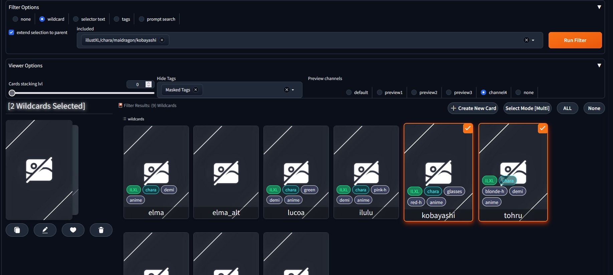
    2. Add the base positive and negative prompts for image generation.
    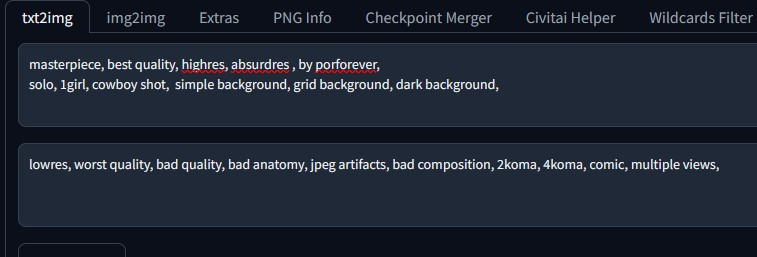
    3. Activate the **Wildcard Preview Utils** script, choose **Preview Generation**, and set the desired **channel** for output.  
       - You can also check how many cards are included in the generation queue by clicking **Count Selected Cards**.
    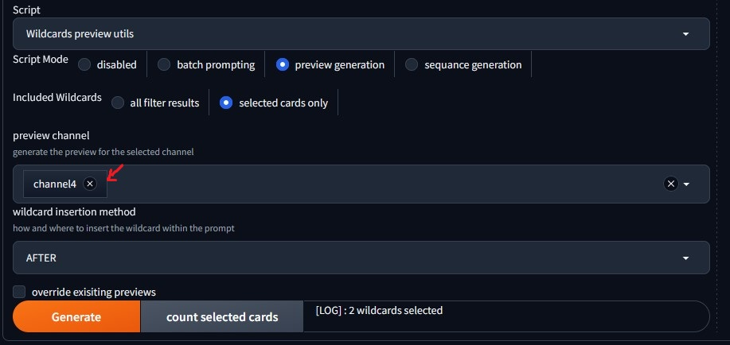
    4. Click **Generate** and wait for the generation queue to finish.
    5. Back in **Wildcard Filter Tab**, confirm that previews were assigned by switching to the correct **channel**.  
       - (Sometimes you may need to deselect and reselect a card for the info to refresh.)
    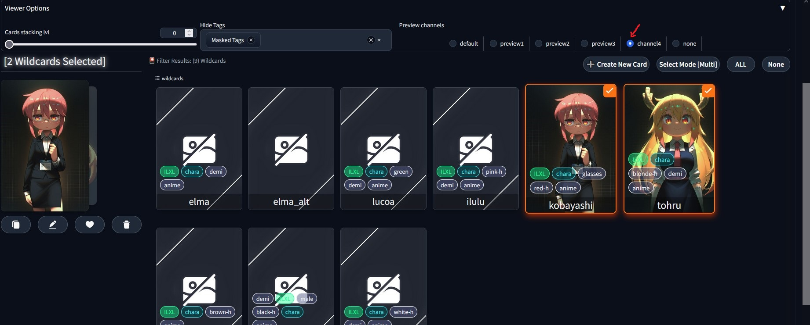